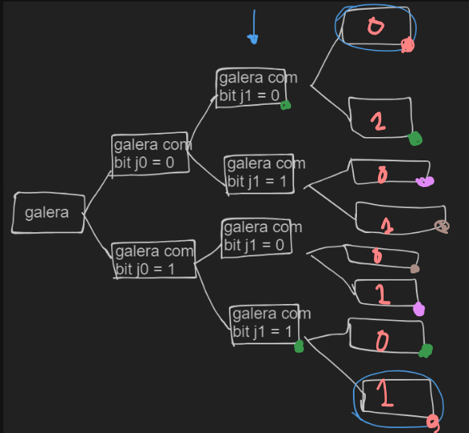

Feito em 26/08/2023

### Problemas

<details>
  <summary><a href="https://codeforces.com/group/nituVTsHQX/contest/469969/problem/A" target="_blank" rel="noreferrer">A. A porta dos desesperados</a></summary>
  
  <p>
    A única probabilidade que importa são as das portas da cor que contém o prêmio, pois se escolhemos a porta de uma outra cor elas são eliminadas.
  </p>

  <p>Então a probabilidade de escolher a porta do prêmio é: <span class="arithmatex">\(\dfrac{1}{cnt[porta]}\)</span></p>
  
  <details>
    <summary>Código</summary>

    ```c++
    #include <bits/stdc++.h>

    // n acho que eu seja bom, mas eu ja fui pior

    using namespace std;

    int main() {
        ios::sync_with_stdio(false);
        cin.tie(NULL);
        
        char choose; cin >> choose;
        
        map<char, int> doors;
        
        cin >> doors['R'];
        cin >> doors['G'];
        cin >> doors['B'];
        
        cout << fixed << setprecision(12) << (double)1 / doors[choose] << '\n';
        
        return 0;
    }
    ```
  </details>
</details>

<details>
  <summary><a href="https://codeforces.com/group/nituVTsHQX/contest/469969/problem/B" target="_blank" rel="noreferrer">B. Bomba-relógio</a></summary>
  
  <p>
    Observe que o número contém somente 18 dígitos, então é possível simular com busca em largura (BFS) até chegar na resposta, que converge rápido, e depois recuperar a resposta da BFS.
  </p>

  <p>Fique atento com overflow ao realizar a operação de produto.</p>

  <details>
    <summary>Código</summary>

    ```c++
    #include <bits/stdc++.h>

    using namespace std;

    using ll = long long;
    using pii = pair<int, int>;
    using vi = vector<int>;

    ll desloca(ll x) {
        if (x < 10) return x;

        string cur = to_string(x);
        string aux = "";

        for (int i = 0; i < (int)cur.size() - 1; i++) {
            aux += cur[i];
        }

        return stoll(aux);
    }

    void solve() {

        ll x; cin >> x;

        queue<pair<ll, int>> q;
        map<ll, bool> used;
        map<ll, pair<ll, char>> p;
        
        q.push({x, 0});
        used[x] = true;
        p[x] = {-1, '$'};

        ll ans;

        while (true) {
            auto [v, dis] = q.front();
            q.pop();

            if (v < 0) continue;

            if (v == 1) {
                ans = dis;
                break;
            }

            ll cur = v * 3;

            if ((double)v * 3.0 <= 1e18 && !used[cur]) {
                used[cur] = true;
                q.push({cur, dis + 1});
                p[cur] = {v, 'L'};
            }

            cur = desloca(v);

            if (!used[cur]) {
                used[cur] = true;
                q.push({ cur, dis + 1 });
                p[cur] = {v, 'R'};
            }
        }
        
        cout << ans << '\n';

        string s = "";

        ll cur = 1;

        while (p[cur].first != -1) {
            s += p[cur].second;
            cur = p[cur].first;
        }

        reverse(s.begin(), s.end());

        cout << s << '\n';
    }

    int main() {
        ios::sync_with_stdio(false);
        cin.tie(NULL);

        int t = 1;
        
        while(t--) {
            solve();
        }

    }
    ```
  </details>
</details>

<details>
  <summary><a href="https://codeforces.com/group/nituVTsHQX/contest/469969/problem/C" target="_blank" rel="noreferrer">C. Conflito PUCmon</a></summary>
  
  <p>
    É só fazer.
  </p>

  <details>
    <summary>Código</summary>

    ```c++
    #include <bits/stdc++.h>

    // n acho que eu seja bom, mas eu ja fui pior

    using namespace std;

    int main() {
        ios::sync_with_stdio(false);
        cin.tie(NULL);
        
        string name, type; cin >> name >> type;

        map<string, string> suf;

        suf["fogo"] = "zard";
        suf["eletricidade"] = "chu";
        suf["agua"] = "tle";
        suf["agua"] = "tle";
        suf["grama"] = "ssauro";
        suf["lutador"] = "pablo";
        suf["normal"] = "";

        cout << name << suf[type] << '\n';
        
        return 0;
    }
    ```
  </details>
</details>

<details>
  <summary><a href="https://codeforces.com/group/nituVTsHQX/contest/469969/problem/D" target="_blank" rel="noreferrer">D. Duda e suas matrizes</a></summary>
  
  <p>
    
  </p>

  <details>
    <summary>Código</summary>

    ```c++
    ```
  </details>
</details>

<details>
  <summary><a href="https://codeforces.com/group/nituVTsHQX/contest/469969/problem/E" target="_blank" rel="noreferrer">E. Encontrando o Culpado</a></summary>
  
  <p>
    É só fazer. Dê uma olhada no código da solução e vê se tira algum proveito das """técnicas""".
  </p>
  
  <details>
    <summary>Código</summary>

    ```c++
    #include <bits/stdc++.h>

    // n acho que eu seja bom, mas eu ja fui pior

    using namespace std;

    int main() {
        ios::sync_with_stdio(false);
        cin.tie(NULL);
        
        int n; cin >> n;
        string s; cin >> s;

        auto count = [&](string t) {
            int cnt = 0;

            for (int i = 0; i < n; i++) {
                cnt += (s[i] == t[i]);
            }

            return cnt;
        };

        int m; cin >> m;
        vector<pair<int, int>> arr(m);

        for (int i = 0; i < m; i++) {
            string cur; cin >> cur;

            arr[i] = { count(cur), -(i + 1) };
        }

        sort(arr.rbegin(), arr.rend());

        for (auto [ff, ss] : arr) {
            cout << -ss << ' ';
        }
        cout << '\n';
        
        return 0;
    }
    ```
  </details>
</details>

<details>
  <summary><a href="https://codeforces.com/group/nituVTsHQX/contest/469969/problem/F" target="_blank" rel="noreferrer">F. Fusão</a></summary>
  
  <p>
    A quantidade de caras com o bit j = 0 tem que ser igual a quantidade de caras com o bit j = 1.

    Porém tem que levar em consideração a mask dos que já pegamos.

    Se não for exatamente metade, então esse bit vai ficar desligado no and, e não dividimos em dois sets.

    Caso contrário, dividimos pq sabemos que ligar aquele bit vai maximizar a resposta.

    E então somamos 2^j na resposta.
  </p>

  

  <details>
    <summary>Código</summary>

    ```c++
    #include <bits/stdc++.h>

    // n acho que eu seja bom, mas eu ja fui pior

    using namespace std;
    using ll = long long;

    int main() {
        ios::sync_with_stdio(false);
        cin.tie(NULL);
        
        int n; cin >> n;
        vector<ll> arr(n);
        for (int i = 0; i < n; i++) {
            cin >> arr[i];
        }
        
        ll ans = 0;
        vector<vector<ll>> galera = { arr };

        for (int j = 60; j >= 0; j--) {
            ll pot = (1LL << j);

            vector<vector<ll>> aux;

            for (auto x : galera) {
                vector<ll> ones, zeros;

                for (auto e : x) {
                    if (pot & e) {
                        ones.push_back(e);
                    } else {
                        zeros.push_back(e);
                    }
                }

                aux.push_back(zeros);
                aux.push_back(ones);
            }

            bool has = true;

            int sz = (int)aux.size();
            for (int i = 0; i < sz; i++) {
                if (aux[i].size() != aux[sz - i - 1].size()) {
                    has = false;
                    break;
                }
            }

            if (has) {
                swap(galera, aux);
                ans += pot;
            }
        }
        
        cout << ans << '\n';
        
        return 0;
    }
    ```
  </details>

  <details>
    <summary>Aprendizado</summary>

    <p>
      Desenhar ajudou muito.
    </p>
  </details>
</details>

<details>
  <summary><a href="https://codeforces.com/group/nituVTsHQX/contest/469969/problem/G" target="_blank" rel="noreferrer">G. Grafo sem enrolação</a></summary>
  
  <p>
    Construa um grafo direcionado com as arestas que ele deu no input. Agora vamos resolver o problema para cada componente conexo individualmente:
  </p>

  <p>
    Se tiver ciclo, a resposta ótima vai ser gastar N arestas, onde N é o tamanho do componente conexo em questão, construindo um grafo que liga todos os nós em sequência (a[0] -> a[1] -> a[2] -> a[3] -> ... -> a[0]).
  </p>

  <p>
    Caso não exista ciclo, a resposta ótima vai ser gastar N - 1 arestas, construindo um grafo linha que liga os nós em sequência de acordo com a <b>ordenação topológica</b> do grafo (topo[0] -> topo[1] -> topo[2] -> ... -> topo[N - 1]).
  </p>

  <details>
    <summary>Código</summary>

    ```c++
    #include <bits/stdc++.h>

    // n acho que eu seja bom, mas eu ja fui pior

    using namespace std;

    const int MAX = (int)1e5+17;

    vector<int> adj[MAX], adj2[MAX];
    bool ex[MAX], used2[MAX], has_cycle[MAX];
    int state[MAX], comp[MAX];

    vector<vector<int>> topo;

    void dfs2(int x, int idx) {
        used2[x] = true;
        comp[x] = idx;

        for (auto e : adj2[x]) {
            if (!used2[e]) {
                dfs2(e, idx);
            }
        }
    }

    void dfs(int x) {
        state[x] = 1;
        
        for (auto e : adj[x]) {
            if (state[e] == 0) {
                dfs(e);
            } else if (state[e] == 1) {
                has_cycle[comp[x]] = true;
            }
        }
        
        state[x] = 2;
        
        topo[comp[x]].push_back(x);
    }

    int main() {
        ios::sync_with_stdio(false);
        cin.tie(NULL);
        
        int n, m; cin >> n >> m;

        for (int i = 0; i < m; i++) {
            int u, v; cin >> u >> v;

            adj[u].push_back(v);
            
            adj2[u].push_back(v);
            adj2[v].push_back(u);

            ex[u] = ex[v] = true;
        }

        // id pra cada componente

        int idx = 0;

        for (int i = 1; i <= n; i++) {
            if (ex[i] && !used2[i]) {
                dfs2(i, idx++);
            }
        }
        
        topo.assign(idx, vector<int>());

        // quais componentes tem ciclo?

        for (int i = 1; i <= n; i++) {
            if (ex[i] && state[i] == 0) {
                dfs(i);
            }
        }

        // calcula resposta

        vector<pair<int, int>> ans;

        for (int i = 0; i < idx; i++) {
            reverse(topo[i].begin(), topo[i].end());

            for (int j = 1; j < (int)topo[i].size(); j++) {
                ans.push_back({ topo[i][j-1], topo[i][j] });
            }

            if (has_cycle[comp[ topo[i].back() ]]) {
                ans.push_back({ topo[i].back(), topo[i][0] });
            }
        }

        cout << ans.size() << '\n';

        for (auto [u, v] : ans) {
            cout << u << ' ' << v << '\n';
        }

        return 0;
    }
    ```
  </details>
</details>

<details>
  <summary><a href="https://codeforces.com/group/nituVTsHQX/contest/469969/problem/H" target="_blank" rel="noreferrer">H. Handle Secreta</a></summary>
  
  <p>
    
  </p>

  <details>
    <summary>Código</summary>

    ```c++
    #include <bits/stdc++.h>
    #define ff first
    #define ss second

    // n acho que eu seja bom, mas eu ja fui pior

    using namespace std;
    using pii = pair<int, int>;

    const int MAX = (int)1e5 + 17;

    bool check(pii a, pii b) {
        if (a.ff >= b.ff && a.ff <= b.ss) return true;
        if (a.ss >= b.ff && a.ss <= b.ss) return true;

        return false;
    }

    int main() {
        ios::sync_with_stdio(false);
        cin.tie(NULL);

        int n, m, k, q; cin >> n >> m >> k >> q;
        vector<vector<pii>> itv(n + 1, vector<pii>());

        for (int i = 0; i < k; i++) {
            int idx, l, r; cin >> idx >> l >> r;

            itv[idx].push_back({l, r});
        }

        int len = (int)sqrt(k);
        
        vector<vector<int>> ps(n + 1, vector<int>()), psl(n + 1, vector<int>());

        for (int i = 1; i <= n; i++) {
            sort(itv[i].begin(), itv[i].end());

            if ((int)itv[i].size() >= len) {
                ps[i].assign(m + 1, 0);
                psl[i].assign(m + 1, 0);

                for (auto [l, r] : itv[i]) {
                    ps[i][l]++;
                    ps[i][r + 1]--;

                    psl[i][l]++;
                }

                for (int j = 1; j <= m; j++) {
                    ps[i][j] += ps[i][j - 1];

                    psl[i][j] += psl[i][j - 1];
                }
            }
        }

        map<pair<int, int>, bool> has;

        while (q--) {
            int a, b; cin >> a >> b;

            if (itv[a].size() > itv[b].size()) {
                swap(a, b);
            }

            if (has.find({a, b}) == has.end()) {
                bool& ans = has[{a, b}];

                if (itv[b].size() >= len) {
                    for (auto [l, r] : itv[a]) {
                        if (ps[b][r] > 0) {
                            ans = true;
                            break;
                        } else if (ps[b][l] > 0) {
                            ans = true;
                            break;
                        } else if (psl[b][r] - psl[b][l - 1] > 0) {
                            ans = true;
                            break;
                        }
                    }
                } else {
                    int jt = 0;

                    for (int it = 0; it < (int)itv[a].size(); it++) {
                        while (jt < (int)itv[b].size() && itv[b][jt].second <= itv[a][it].first) { // r_b > l_a
                            jt++;
                        }

                        if (jt < (int)itv[b].size() && (check(itv[a][it], itv[b][jt]) || check(itv[b][jt], itv[a][it]))) {
                            ans = true;
                        }
                    }
                }

            }

            cout << (has[{a, b}] ? "Nao eh o Tiagobfs :c" : "TIAGOBFS???") << '\n';
        }

        return 0;
    }
    ```
  </details>
</details>

<details>
  <summary><a href="https://codeforces.com/group/nituVTsHQX/contest/469969/problem/I" target="_blank" rel="noreferrer">I. Inventando a Exponencial</a></summary>
  
  <p>
    
  </p>

  <details>
    <summary>Código</summary>

    ```c++
    ```
  </details>
</details>

<details>
  <summary><a href="https://codeforces.com/group/nituVTsHQX/contest/469969/problem/I" target="_blank" rel="noreferrer">J. Jotinha no Jogo</a></summary>
  
  <p>
    <a href="https://youtu.be/VDUy9H9C3-8?si=EnTP_lPp8sOPH-ln&t=91" target="_blank" rel="noreferrer">Vídeo explicando.</a>
  </p>

  <details>
    <summary>Código</summary>

    ```c++
    #include <bits/stdc++.h>

    // n acho que eu seja bom, mas eu ja fui pior

    using namespace std;
    using ll = long long;

    const int MOD = (int)1e9+7;

    ll fexp(ll base, ll exp, ll m) {
        ll ans = 1;
        base %= m;
        
        while (exp > 0) {
            if (exp % 2 == 1) {
                ans = (ans * base) % m;
            }
    
            base = (base * base) % m;
            exp /= 2;
        }
    
        return ans;
    }

    int main() {
        ios::sync_with_stdio(false);
        cin.tie(NULL);
        
        int t; cin >> t;
        while (t--) {
            ll a, b, c; cin >> a >> b >> c;

            ll num = (a * a + b * a - c * a) % MOD;
            ll den = (a + b);
            
            ll ans = (num * fexp(den, MOD - 2, MOD)) % MOD;
            
            cout << ans << '\n';
        }
        
        return 0;
    }
    ```
  </details>
</details>

<details>
  <summary><a href="https://codeforces.com/group/nituVTsHQX/contest/469969/problem/K" target="_blank" rel="noreferrer">K. Kátia e os palíndromos de César</a></summary>
  
  <p>
    É possível pré-computar 26 hashs da string original, uma para cada rotação, e então testar cada substring [i, i+m] se, para alguma rotação, a condição é satisfeita (primeira metade da string == segunda metade da string invertida e rotacionada k vezes), e se for, incrementa a resposta e passa para a próxima posição inicial i. Olhe o código para mais detalhes.
  </p>

  <details>
    <summary>Código</summary>

    ```c++
    #include <bits/stdc++.h>

    // n acho que eu seja bom, mas eu ja fui pior

    using namespace std;
    using ll = long long;

    const int MOD = (int)1e9 + 7;

    struct Hash {
        const ll P = 31;
        int n; string s;
        vector<ll> h, hi, p;
        Hash() {}
        Hash(string s): s(s), n(s.size()), h(n), hi(n), p(n) {
            for (int i=0;i<n;i++) p[i] = (i ? P*p[i-1]:1) % MOD;
            for (int i=0;i<n;i++)
                h[i] = (s[i] + (i ? h[i-1]:0) * P) % MOD;
            for (int i=n-1;i>=0;i--) 
                hi[i] = (s[i] + (i+1<n ? hi[i+1]:0) * P) % MOD;
        }
        int query(int l, int r) {
            ll hash = (h[r] - (l ? h[l-1]*p[r-l+1]%MOD : 0));
            return hash < 0 ? hash + MOD : hash;
        }
        int query_inv(int l, int r) {
            ll hash = (hi[l] - (r+1 < n ? hi[r+1]*p[r-l+1] % MOD : 0));
            return hash < 0 ? hash + MOD : hash;
        }
    };

    string rot(string s) {
        for (auto &c : s) {
            c = char((((c - 'a') + 1) % 26) + 'a');
        }

        return s;
    }

    int main() {
        ios::sync_with_stdio(false);
        cin.tie(NULL);
        
        int n, m; cin >> n >> m;
        string s; cin >> s;

        vector<Hash> hash;
        
        for (int i = 0; i < 26; i++) {
            hash.push_back(Hash(s));
            s = rot(s);
        }

        if (m == 1) {
            cout << n << '\n';
            return 0;
        }

        int ans = 0;

        for (int i = 0; i <= n - m; i++) {
            for (int k = 0; k < 26; k++) {
                if (m % 2 == 1) {
                    int it = hash[0].query(i, i + m / 2 - 1);
                    int jt = hash[k].query_inv(i + m / 2 + 1, i + m - 1);
                    
                    if (it == jt) {
                        ans++;
                        break;
                    }
                } else {
                    int it = hash[0].query(i, i + m / 2 - 1);
                    int jt = hash[k].query_inv(i + m / 2, i + m - 1);

                    if (it == jt) {
                        ans++;
                        break;
                    }
                }
            }
        }

        cout << ans << '\n';

        return 0;
    }
    ```
  </details>
</details>

<details>
  <summary><a href="https://codeforces.com/group/nituVTsHQX/contest/469969/problem/L" target="_blank" rel="noreferrer">L. Lenhadoras de segtree</a></summary>
  
  <p>
    O problema aqui é que, ao mudar de nó, enraizamos a árvore no novo nó. Ao trocar de nó, queremos saber o tamanho do componente conexo do pai de x, que é n - sz[x] (pense no porquê). Então, caso exista pai, somamos também o quadrado desse valor na resposta de x, além do quadrado dos filhos na "árvore original" (enraizada em 1).
  </p>

  <p>
    Desenhar ajuda bastante. Leia o código da DFS pra ficar mais claro.
  </p>
  
  <details>
    <summary>Código</summary>

    ```c++
    #include <bits/stdc++.h>

    // n acho que eu seja bom, mas eu ja fui pior

    using namespace std;
    using ll = long long;

    const int MAX = (int)2e5 + 17;

    int n;
    vector<int> adj[MAX];
    ll sz[MAX], ans[MAX];

    void dfs_sz(int x, int p) {
        sz[x] = 1;

        for (auto e : adj[x]) {
            if (e != p) {
                dfs_sz(e, x);
                sz[x] += sz[e];
            }
        }
    }

    void dfs(int x, int p) {
        for (auto e : adj[x]) {
            if (e != p) {
                ans[x] += sz[e] * sz[e];
            }
        }

        if (p != -1) {
            ans[x] += (n - sz[x]) * (n - sz[x]);
        }
        
        for (auto e : adj[x]) {
            if (e != p) {
                dfs(e, x);
            }
        }
    }

    int main() {
        ios::sync_with_stdio(false);
        cin.tie(NULL);
        
        cin >> n;
        for (int i = 0; i < n - 1; i++) {
            int a, b; cin >> a >> b;

            adj[a].push_back(b);
            adj[b].push_back(a);
        }

        dfs_sz(1, 1);

        dfs(1, 1);

        for (int i = 1; i <= n; i++) {
            cout << ans[i] << ' ';
        }
        cout << '\n';
        
        return 0;
    }
    ```
  </details>
</details>

<details>
  <summary><a href="https://codeforces.com/group/nituVTsHQX/contest/469969/problem/M" target="_blank" rel="noreferrer">M. Mitose Marciana</a></summary>
  
  <p>
    
  </p>

  <details>
    <summary>Código</summary>

    ```c++
    #include <bits/stdc++.h>

    // n acho que eu seja bom, mas eu ja fui pior

    using namespace std;
    using ll = long long;
    using ld = long double;

    vector<ll> divisors(ll n) {
        vector<ll> ans;

        for (ll i = 1; i*i <= n; i++) {
            if (n%i == 0) {
                ll value = n/i;
                
                ans.push_back(i);
                if (value != i) {
                    ans.push_back(value);
                }
            }
        }
        
        return ans;
    }

    ll mul(ll a, ll b, ll m) {
        ll ret = a*b - (ll)((ld)1/m*a*b+0.5)*m;
        return ret < 0 ? ret+m : ret;
    }

    ll pow(ll a, ll b, ll m) {
        ll ans = 1;
        for (; b > 0; b /= 2ll, a = mul(a, a, m)) {
            if (b % 2ll == 1)
                ans = mul(ans, a, m);
        }
        return ans;
    }

    bool prime(ll n) {
        if (n < 2) return 0;
        if (n <= 3) return 1;
        if (n % 2 == 0) return 0;

        ll r = __builtin_ctzll(n - 1), d = n >> r;
        for (int a : {2, 325, 9375, 28178, 450775, 9780504, 795265022}) {
            ll x = pow(a, d, n);
            if (x == 1 or x == n - 1 or a % n == 0) continue;
            
            for (int j = 0; j < r - 1; j++) {
                x = mul(x, x, n);
                if (x == n - 1) break;
            }
            if (x != n - 1) return 0;
        }
        return 1;
    }

    ll rho(ll n) {
        if (n == 1 or prime(n)) return n;
        auto f = [n](ll x) {return mul(x, x, n) + 1;};

        ll x = 0, y = 0, t = 30, prd = 2, x0 = 1, q;
        while (t % 40 != 0 or gcd(prd, n) == 1) {
            if (x==y) x = ++x0, y = f(x);
            q = mul(prd, abs(x-y), n);
            if (q != 0) prd = q;
            x = f(x), y = f(f(y)), t++;
        }
        return gcd(prd, n);
    }

    vector<ll> fact(ll n) {
        if (n == 1) return {};
        if (prime(n)) return {n};
        ll d = rho(n);
        vector<ll> l = fact(d), r = fact(n / d);
        l.insert(l.end(), r.begin(), r.end());
        return l;
    }

    ll sum(ll n) {
        auto factors = fact(n);

        map<ll, ll> cnt;
        for (auto f : factors) {
            cnt[f]++;
        }

        ll ans = 1;

        for (auto [p, a] : cnt) {
            ans *= (pow(p, a + 1, LLONG_MAX) - 1) / (p - 1);
        }

        return ans;
    }

    int main() {
        ios::sync_with_stdio(false);
        cin.tie(NULL);
        
        ll n; cin >> n;
        auto div = divisors(n);

        ll ans = 0;

        for (auto e : div) {
            ans += sum(e);
        }

        cout << ans << '\n';
        
        return 0;
    }
    ```
  </details>
</details>

### Upsolving

Todas feitas ;)
